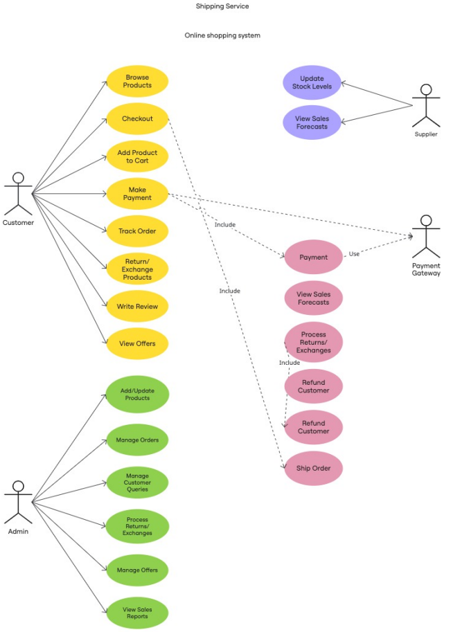
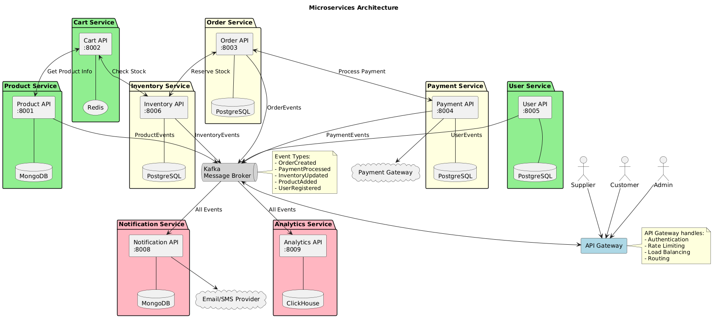

# **Diagrama de casos de Uso**



# **Modulos Funcionales identificados**

## 1. Gestion de Catalogo : Administración de productos y ofertas

* Browse Products (Navegar productos)
* Add/Update Products (Agregar/actualizar productos)
* View Offers (Ver ofertas)
* Manage Offers (Gestionar ofertas)

## 2. Carrito de Compras : Gestión del proceso de compra

* Add Product to Cart (Agregar producto al carrito)
* Checkout (Realizar compra)
* Make Payment (Realizar pago)

## 3. Pedidos : Administración completa de órdenes

* Track Order (Rastrear pedido)
* Manage Orders (Gestionar pedidos)
* Ship Order (Enviar pedido)

## 4. Pagos: Procesamiento de transacciones financieras

* Payment (Pago) - proceso central
* Refund Customer (Reembolsar cliente)
* Integración con Payment Gateway

## 5. Gestion Postventa : Devoluciones, intercambios y reclamos

* Return/Exchange Products (Devolver/intercambiar productos)
* Process Returns/Exchanges (Procesar devoluciones/intercambios)
* Refund Customer (Reembolsar cliente)

## 6. Inventario : Control de stock y suministros

* Update Stock Levels (Actualizar niveles de stock)
* View Sales Forecasts (Ver pronósticos de ventas)

## 7. Atencion al cliente : Soporte y comunicación con clientes

* Write Review (Escribir reseña)
* Manage Customer Queries (Gestionar consultas de clientes)

## 8. Reporteria : Inteligencia de negocio y reportería

* View Sales Reports (Ver reportes de ventas)
* View Sales Forecasts (Ver pronósticos de ventas)

# Proposicion de Arquitectura

# Arquitectura de Microservicios



## 1. MICROSERVICIOS PRINCIPALES

### **Product Service**: Gestión completa del catálogo

* **Funcionalidades** :
  * CRUD de productos
  * Gestión de categorías
  * Búsqueda y filtrado
  * Gestión de ofertas y promociones
  * **Base de datos** : MongoDB (NoSQL para flexibilidad de catálogo)
  * **Puerto** : 8001
  * **APIs** :
    * `GET /products` - Listar productos
    * `POST /products` - Crear producto
    * `PUT /products/{id}` - Actualizar producto
    * `GET /products/search` - Búsqueda avanzada

### **Cart Service** : Gestión de carritos de compra

* **Funcionalidades** :
  * Agregar/remover productos del carrito
  * Calcular totales
  * Aplicar descuentos
  * Gestión de sesiones de carrito
  * **Base de datos** : Redis (cache para sesiones activas)
  * **Puerto** : 8002
  * **APIs** :
    * `POST /cart/add` - Agregar al carrito
    * `GET /cart/{userId}` - Obtener carrito
    * `DELETE /cart/{userId}/item/{productId}` - Remover item

### **Order Service**: Gestión completa de pedidos

* **Funcionalidades** :
  * Crear órdenes desde carritos
  * Seguimiento de estados
  * Historial de pedidos
  * Gestión de envíos
  * **Base de datos** : PostgreSQL (ACID para transacciones)
  * **Puerto** : 8003
  * **APIs** :
    * `POST /orders` - Crear orden
    * `GET /orders/{orderId}` - Obtener orden
    * `PUT /orders/{orderId}/status` - Actualizar estado

### **Payment Service**

* **Responsabilidades** : Procesamiento de pagos
  * **Funcionalidades** :
  * Integración con gateways de pago
  * Procesamiento de transacciones
  * Gestión de reembolsos
  * Validación de métodos de pago
  * **Base de datos** : PostgreSQL (seguridad y consistencia)
  * **Puerto** : 8004
  * **APIs** :
    * `POST /payments/process` - Procesar pago
    * `POST /payments/refund` - Procesar reembolso
    * `GET /payments/{paymentId}` - Estado del pago

### **User Service** : Gestión de usuarios y autenticación

* **Funcionalidades** :
  * Registro y autenticación
  * Gestión de perfiles
  * Roles y permisos
  * Preferencias de usuario
  * **Base de datos** : PostgreSQL
  * **Puerto** : 8005
  * **APIs** :
    * `POST /users/register` - Registro
    * `POST /users/login` - Autenticación
    * `GET /users/{userId}` - Perfil de usuario

### **Inventory Service**: Control de inventario

* **Funcionalidades** :
  * Gestión de stock
  * Reservas de inventario
  * Alertas de stock bajo
  * Pronósticos de demanda
  * **Base de datos** : PostgreSQL
  * **Puerto** : 8006
  * **APIs** :
    * `GET /inventory/{productId}` - Stock disponible
    * `POST /inventory/reserve` - Reservar stock
    * `PUT /inventory/update` - Actualizar inventario

### **Returns Service** : Gestión de devoluciones

* **Funcionalidades** :
  * Procesar solicitudes de devolución
  * Gestión de intercambios
  * Autorización de devoluciones
  * Integración con reembolsos
  * **Base de datos** : PostgreSQL
  * **Puerto** : 8007
  * **APIs** :
    * `POST /returns/request` - Solicitar devolución
    * `PUT /returns/{returnId}/approve` - Aprobar devolución

### **Notification Service**

* **Responsabilidades** : Comunicaciones y notificaciones
* **Funcionalidades** :
  * Envío de emails
  * Notificaciones push
  * SMS
  * Gestión de templates
  * **Base de datos** : MongoDB
  * **Puerto** : 8008
  * **APIs** :
    * `POST /notifications/send` - Enviar notificación
    * `GET /notifications/{userId}` - Historial de notificaciones

### **Analytics Service**

* **Responsabilidades** : Reportes y análisis
* **Funcionalidades** :
  * Reportes de ventas
  * Análisis de comportamiento
  * KPIs del negocio
  * Dashboards
  * **Base de datos** : ClickHouse (OLAP)
  * **Puerto** : 8009
  * **APIs** :
    * `GET /analytics/sales-report` - Reporte de ventas
    * `GET /analytics/customer-behavior` - Análisis de clientes

## 2. SERVICIOS DE INFRAESTRUCTURA

### **API Gateway**

* **Tecnología** :  AWS API Gateway /
* **Responsabilidades** :
  * Enrutamiento de requests
  * Autenticación y autorización
  * Rate limiting
  * Monitoreo y logging
  * **Puerto** : 8000

### **Service Discovery**

* **Tecnología** : Consul / Eureka
* **Responsabilidades** :
  * Registro de servicios
  * Health checks
  * Load balancing
  * Service mesh

## 3. COMUNICACIÓN ENTRE SERVICIOS

### **Comunicación Síncrona**

* **Protocolo** : HTTP/REST + gRPC
* **Casos de uso** :
* Consultas en tiempo real
* Validaciones críticas
* Operaciones que requieren respuesta inmediata

### **Comunicación Asíncrona**

* **Message Broker** : Apache Kafka / RabbitMQ
* **Patrones** :
* Event Sourcing
* CQRS (Command Query Responsibility Segregation)
* Saga Pattern para transacciones distribuidas

## 4. PATRONES DE DISEÑO IMPLEMENTADOS

### **Circuit Breaker**

* Implementado en llamadas entre servicios
* Previene cascading failures
* Fallback mechanisms

### **Database per Service**

* Cada microservicio tiene su propia base de datos
* Diferentes tipos según necesidades:
  * PostgreSQL: Transaccional
  * MongoDB: Documental
  * Redis: Cache
  * ClickHouse: Analítica

## 5. ESTRATEGIA DE DEPLOYMENT

### **Containerización**

* Docker containers para cada servicio
* Docker Compose para desarrollo local
* Kubernetes para producción

### **CI/CD Pipeline**

```
Source Code → Build → Test → Security Scan → Deploy to Staging → Integration Tests → Deploy to Production
```

## 6. SEGURIDAD

### **Autenticación & Autorización**

* JWT tokens
* OAuth 2.0 / OpenID Connect
* Role-based access control (RBAC)

### **Seguridad de Datos**

* Encriptación en tránsito (TLS)
* Encriptación en reposo
* PCI DSS compliance para pagos

# Justificacion

Esta arquitectura permite que el sistema sea  **altamente escalable** , **resiliente** y  **mantenible** , con equipos independientes trabajando en cada servicio.

- Cada microservicio representa un **bounded context** específico del dominio del sistema.
- Cada servicio tiene una **responsabilidad única y bien definida.**
- Cada servicio es **propietario exclusivo** de sus datos.
- Datos analíticos no bloquean operaciones transaccionales

# Despliegue

Se utiliza Kong que es **nuestro API Gateway** , es decir, es la **puerta de entrada** o **único punto de acceso** a todos tus microservicios.

En lugar de exponer cada microservicio directamente al cliente, se pone **Kong en medio** .

## [Docker-Compose](docker-compose.yml)

`docker compose up -d`

* Levanta **Kong** junto con tus microservicios.
* Aplica automáticamente el **declarative config** incluido en `kong.yaml`.

para levantar nuevos servicios sin bajar el contenedor 

`kong reload -p /usr/local/kong`

`docker compose restart kong `
